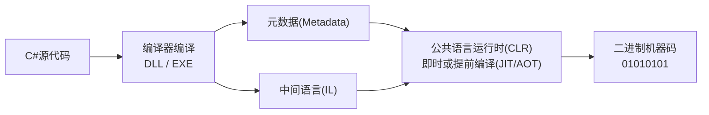

> [!summary]
> 总的来说，这两个要点都和游戏的基本gameplay相关开发没有什么比较直接的运用。更多在于开发工具和一些高级业务需求上。
# 基本概念梳理

**反射 (Reflection)** 是一种编程机制，允许程序在**运行时**动态地检查和操作自身的结构和行为。这个概念不是指任何代码中的数据类型或是关键字，而是一个**抽象出来的编程机制**。也就是说，使得程序能够在运行期间获取**类**、**对象**、**方法**、**属性**等信息，并能够动态地**调用方法**、**创建实例**或**修改属性**的这些个特点被称为反射。

> 在小型项目开发中，因为项目系统复杂度较低，反射的应用场景比较有限。
> 反射通常可以用于：**编辑器扩展**、**序列化/反序列化**、**热更新**等相关的需求。此外，值得一提的是Unity引擎底层的不少功能实现也是基于反射机制。

---

**特性 (Attribute)** 本质上是一个C#的类，我们可以使用这个类型来向程序集直接添加特定**元数据**以在**类**、**对象**、**方法**、**属性**等代码结构上标注特定信息。这些标注既不属于任何数据类型或关键字，也不会直接影响代码的逻辑执行，但在编译或运行时可以通过**反射**等方式被读取和解析，从而指导程序的特定行为或配置。

---

# 相关要点
## 反射的原理

从编译运行的流程上来看，**C# 源代码**首先由编译器转换为**中间语言 (IL)**，然后由**公共语言运行时 (CLR)** 进行**加载和即时编译 (JIT)**，最终在**运行时**执行并支持反射。再具体来说，.NET 应用程序是由**程序集 (Assembly)**、**模块 (Module)** 、**类型 (Class)** 等部分组成的。而反射就是在运行时通过读取编译后程序集中的**元数据 (Metadata)** 来获取这些类型定义信息，从而在运行时实现动态操作。

> Unity中的C#脚本编译过程会略有不同，取决于使用的解决方案。
> 像是IL2CPP或是启用Burst编译优化的话就比较特殊，详见[DWHITE/3_编程与开发/Unity/Unity_CSharp脚本的编译运行](/posts/dwhite-3_编程与开发-unity-unity_csharp脚本的编译运行)

## 反射的优缺点

| **优点**                        | **缺点**                                                                                                       |
| ----------------------------- | ------------------------------------------------------------------------------------------------------------ |
| 提高程序的灵活性与扩展性。                 | **性能问题**：反射本质上是一种解释操作，需要进行字符串匹配等，用于字段与方法接入时将远慢于直接的编译期绑定方式。                                                   |
| 降低代码的耦合性，提高自适应能力。             | **可读性与维护难度**：反射的运用会使得部分程序逻辑被“隐藏”，调用链条不直观，调试时难以从源代码中直接预期逻辑如何发生。                                               |
| 使得程序能够创建和控制任何类的对象，而无需提前硬编码目标。 | **安全性问题**：通过反射可访问私有成员、破坏封装，若管理不当会造成敏感数据泄露或其他安全风险。                                                            |
| 可在运行时动态检查或修改类的结构信息。           | **潜在兼容性风险**：过度依赖运行时的类名、方法名字符串，若类或方法被重命名或移除，则可能在反射调用处引发 `ClassNotFoundException`、`NoSuchMethodException` 等错误。 |