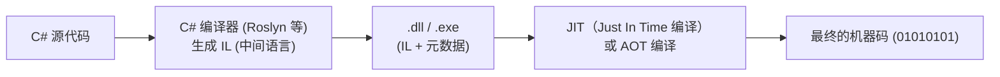
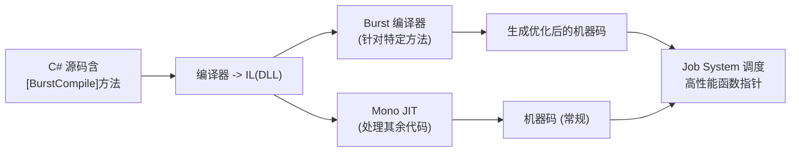

本文概述了 Unity 中 C# 脚本可能经历的不同编译与运行流程。有待进一步整理润色。

---

## 一、常规 .NET 环境下的 C# 编译执行（对比参考）

在开始讨论 Unity 之前，先看一下最常见的 .NET 程序是如何从 C# 源码变成可以运行的机器码的（以 .NET 6/.NET Framework 等为例）：

- **C# 源代码**：就是我们日常写的 `.cs` 脚本。
- **编译器**：将 `.cs` 编译为 IL（Intermediate Language），并存储在 `.dll` 或 `.exe` 文件。
- **JIT / AOT**：在运行时（或在发布时），由 CLR 或其他运行时环境将 IL 转换为机器码。
- **机器码**：最终在操作系统和 CPU 上执行。

这个流程在 Unity 的编辑器里，也或多或少有类似之处，只是 Unity 在**发布构建**时会有更多处理。

---

## 二、Unity 编辑器模式下的脚本执行（Mono）

当你在 **Unity 编辑器** 中按下 “Play” 时，大多数时候脚本是通过 **Mono**（或可选的 .NET Core 体验）来执行的，以便实现快速开发、调试、热重载等需求。

- **编辑器**下，Unity 并不会做复杂的 AOT 转换，为的是让开发者能快速迭代、打断点调试。
- 如果项目中启用了 **Burst Compiler**，则标记了 `[BurstCompile]` 的方法依旧会由 Burst 专门编译出更高性能的机器码（详见后文）。

---

## 三、发布构建时的 IL2CPP 工作原理

一旦我们要真正发布项目（尤其是移动设备或主机平台），Unity 通常会启用 **IL2CPP**。这是 Unity 提供的“IL -> C++ -> 机器码”的 AOT 编译流程。大致可以分为以下步骤：

- **IL2CPP** 会分析所有脚本生成的 IL，将其转成一堆对应的 C++ 源文件。
- 最后，再由平台自带的编译器（如 Clang、MSVC、Android NDK 等）把 C++ 编译为可执行文件或库。
- 对于很多限制 JIT 的平台（如 iOS）或游戏主机，这是必然选择。

### AOT 与反射

即使走了 AOT，一些反射功能仍然可用，只要相关元数据没有被裁剪（Stripping）。Unity 会在构建时把必要的元数据打包进去，以支持 `Type.GetType`, `MethodInfo.Invoke` 等常见的反射用法。但像 `System.Reflection.Emit` 这种动态生成代码的操作，在 AOT 环境下就行不通了。

---

## 四、Burst Compiler：在关键代码上进一步优化

**Burst Compiler** 是 Unity 针对 **Job System / DOTS / ECS** 高并发场景下的高性能编译器。它可以直接从 IL 生成深度优化的机器码（包括 SIMD、向量化等），提升运算密集型逻辑的速度。它与 Mono 或 IL2CPP 并不冲突，而是**并行存在**：

1. 在 **编辑器（Mono）** 下运行时，如果方法标记了 `[BurstCompile]`，则在运行时可由 Burst 编译器编译成机器码；如果 Burst 编译失败或不启用，则回退到 Mono JIT 的托管版本。
2. 在 **IL2CPP** 构建中，带 `[BurstCompile]` 的代码同样会由 Burst 做“IL -> 机器码”的转换，然后与 IL2CPP 转换的代码一同打包进最终可执行文件。Job System 在调度时会直接调用 Burst 优化后的函数指针。

简化的流程可用下图展示（以编辑器下 Mono + Burst 为例）：

最终运行时，**非 Burst** 方法走 Mono JIT 的机器码，**Burst** 方法则调用专门优化过的那部分机器码。

---

## 五、总结

- **编辑器模式（Mono 或 .NET Core）**：C# 脚本以常规 IL 形式编译后，通过 **Mono JIT**（或 .NET Core）运行，方便开发调试。
- **IL2CPP**：发布构建时，把所有 IL 转为 C++ 并再编译为目标机器码，适配各种平台并满足 AOT 需求。
- **Burst Compiler**：对有 `[BurstCompile]` 标记的代码进行更高强度的优化编译，可与 Mono 或 IL2CPP 同时使用，从而提升数据并行任务的性能。
- **反射** 等元数据相关功能，在 AOT 环境下仍旧可用，只要确认编译时没有被裁剪。

上述流程组合在一起，就形成了**Unity 在不同阶段、不同平台上对 C# 脚本编译与运行的灵活方案**：编辑器开发时尽量高效迭代，发布时尽量兼容性好并尽量获取更高性能，而对于关键性能区域（Jobs/ECS），再借助 Burst 来让你的游戏或应用运行得更快。